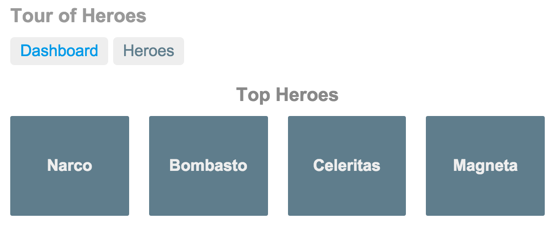

# Aplicación y tutorial Tour of Heroes

> ## EMPEZANDO
>
> En este tutorial, creará su propia aplicación desde cero, proporcionando experiencia con el proceso de desarrollo típico, así como una introducción a los conceptos, herramientas y terminología básicos de diseño de aplicaciones.
>
> Si es completamente nuevo en Angular, es posible que desee probar primero la aplicación de inicio rápido [**Pruébelo ahora**](https://angular.io/start). Se basa en un proyecto listo para usar y parcialmente completado, que puede examinar y modificar en el entorno de desarrollo interactivo StackBlitz, donde puede ver los resultados en tiempo real.
>
> El tutorial "Pruébelo" cubre los mismos temas principales (componentes, sintaxis de plantilla, enrutamiento, servicios y acceso a datos mediante HTTP) en un formato condensado, siguiendo las mejores prácticas más actuales.

Este tutorial de _Tour of Heroes_ le muestra cómo configurar su entorno de desarrollo local y desarrollar una aplicación utilizando la [herramienta CLI de Angular](https://angular.io/cli), y proporciona una introducción a los fundamentos de Angular.

La aplicación _Tour of Heroes_ que creas ayuda a una agencia de personal a administrar su establo de héroes. La aplicación tiene muchas de las características que esperaría encontrar en cualquier aplicación basada en datos. La aplicación terminada adquiere y muestra una lista de héroes, edita los detalles de un héroe seleccionado y navega entre diferentes vistas de datos heroicos.

Encontrará referencias y expansiones de este dominio de aplicación en muchos de los ejemplos utilizados en la documentación de Angular, pero no es necesario que siga este tutorial para comprender esos ejemplos.

Al final de este tutorial, podrá hacer lo siguiente:

- Usar [directivas](https://angular.io/guide/glossary#directive) de Angular integradas para mostrar y ocultar elementos y mostrar listas de datos de héroes.
- Crear [componentes](https://angular.io/guide/glossary#component) de Angular para mostrar detalles de héroes y mostrar una variedad de héroes.
- Utilizar el [enlace de datos unidireccional](https://angular.io/guide/glossary#data-binding) para datos de solo lectura.
- Agregar campos editables para actualizar un modelo con enlace de datos bidireccional.
- Vincular métodos de componentes a eventos de usuario, como pulsaciones de teclas y clics.
- Permitir a los usuarios seleccionar un héroe de una lista maestra y editar ese héroe en la vista de detalles.
- Formatear los datos con [pipes](https://angular.io/guide/glossary#pipe).
- Crear un [servicio](https://angular.io/guide/glossary#service) compartido para reunir a los héroes.
- Utilice el [enrutamiento](https://angular.io/guide/glossary#router) para navegar entre diferentes vistas y sus componentes.

Aprenderá lo suficiente sobre Angular para comenzar y obtendrá la confianza de que Angular puede hacer lo que necesite.

> ## SOLUCIÓN
>
> Después de completar todos los pasos del tutorial, la aplicación final se verá así: [ejemplo en vivo](https://angular.io/generated/live-examples/toh-pt6/stackblitz.html)/[ejemplo de descarga](https://angular.io/generated/zips/toh-pt6/toh-pt6.zip).

---

## Lo que vas a construir

Aquí hay una idea visual de hacia dónde conduce este tutorial, comenzando con la vista "Panel de control" y los héroes más heroicos:

Puedes hacer clic en los dos enlaces que se encuentran encima del panel ("Dashboard" y "Heroes") para navegar entre esta vista del Panel y la vista de Héroes.

Si haces clic en el héroe del tablero "Magneta", el enrutador abre una vista de "Detalles del héroe" donde puedes cambiar el nombre del héroe.

Al hacer clic en el botón "Back", volverá al panel de control. Los enlaces en la parte superior lo llevan a cualquiera de las vistas principales. Si hace clic en "Heroes", la aplicación muestra la vista de lista maestra de "Heroes".

Cuando haces clic en un nombre de héroe diferente, el mini detalle de solo lectura debajo de la lista refleja la nueva elección.

Puedes hacer clic en el botón "View Details" para profundizar en los detalles editables del héroe seleccionado.

El siguiente diagrama captura todas las opciones de navegación.

Aquí está la aplicación en acción:

