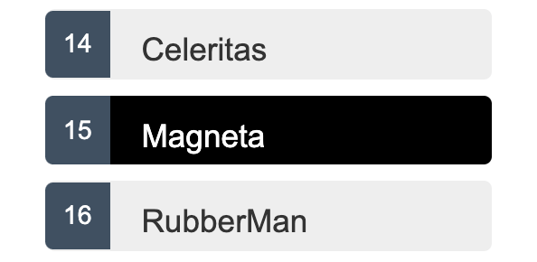

# Mostrar una lista de selección

En esta página, expandirá la aplicación Tour of Heroes para mostrar una lista de héroes y permitirá a los usuarios seleccionar un héroe y mostrar los detalles del héroe.

> Para ver la aplicación de muestra que se describe en esta página, consulte la [ejemplo en vivo](https://angular.io/generated/live-examples/toh-pt2/stackblitz.html)/[ejemplo de descarga](https://angular.io/generated/zips/toh-pt2/toh-pt2.zip).

---

## Crea héroes simulados

Necesitarás algunos héroes para mostrar.

Eventualmente los obtendrá de un servidor de datos remoto. Por ahora, creará algunos _héroes simulados_ y pretenderá que provienen del servidor.

Cree un archivo llamado `mock-heroes.ts` en la carpeta `src/app/`. Defina una constante `HEROES` como una matriz de diez héroes y expórtela. El archivo debería verse así.

```ts
// src/app/mock-heroes.ts

import { Hero } from "./hero";

export const HEROES: Hero[] = [
  { id: 11, name: "Dr Nice" },
  { id: 12, name: "Narco" },
  { id: 13, name: "Bombasto" },
  { id: 14, name: "Celeritas" },
  { id: 15, name: "Magneta" },
  { id: 16, name: "RubberMan" },
  { id: 17, name: "Dynama" },
  { id: 18, name: "Dr IQ" },
  { id: 19, name: "Magma" },
  { id: 20, name: "Tornado" },
];
```

---

## Mostrando héroes

Abra el archivo de clase `HeroesComponent` e importe el mock `HEROES`.

```ts
// src/app/heroes/heroes.component.ts (import HEROES)

import { HEROES } from "../mock-heroes";
```

En el mismo archivo (clase `HeroesComponent`), defina una propiedad de componente llamada `heroes` para exponer la matriz `HEROES` para la vinculación.

```ts
src / app / heroes / heroes.component.ts;

export class HeroesComponent implements OnInit {
  heroes = HEROES;
}
```

### Lista de héroes con [\*ngFor](https://angular.io/api/common/NgForOf)

Abra el archivo de plantilla `HeroesComponent` y realice los siguientes cambios:

- Agregue un `<h2>` en la parte superior,
- Debajo, agregue una lista HTML desordenada (`<ul>`)
- Inserte un `<li>` dentro del `<ul>` que muestra las propiedades de un hero.
- Espolvoree algunas clases de CSS para diseñar (agregará los estilos CSS en breve).

Haz que se vea así:

```html
<!-- heroes.component.html (plantilla de héroes) -->

<h2>My Heroes</h2>
<ul class="heroes">
  <li><span class="badge">{{hero.id}}</span> {{hero.name}}</li>
</ul>
```

Eso muestra un error ya que la propiedad 'hero' no existe. Para tener acceso a cada héroe individual y enumerarlos a todos, agregue un [`*ngFor`](https://angular.io/api/common/NgForOf) al `<li>` para recorrer la lista de héroes:

```html
<li *ngFor="let hero of heroes"></li>
```

El \*ngFor es la directiva _repetidora_ de Angular. Repite el elemento anfitrión para cada elemento de una lista.

La sintaxis en este ejemplo es la siguiente:

- `<li>` es el elemento anfitrión.
- `heroes` contiene la lista de héroes simulados de la clase `HeroesComponent`, la lista de héroes simulados.
- `hero` contiene el objeto héroe actual para cada iteración a través de la lista.

> No olvide el asterisco (\*) delante de [`ngFor`](https://angular.io/api/common/NgForOf). Es una parte fundamental de la sintaxis.

Una vez que se actualiza el navegador, aparece la lista de héroes.

### Estilo a los heroes

La lista de héroes debe ser atractiva y responder visualmente cuando los usuarios se desplazan y seleccionan un héroe de la lista.

En el [primer tutorial](../crear-un-proyecto#agregar-estilos-de-aplicacion), estableces los estilos básicos para toda la aplicación en `styles.css`. Esa hoja de estilo no incluía estilos para esta lista de héroes.

Puede agregar más estilos en `styles.css` y seguir creciendo en esa hoja de estilo a medida que agrega componentes.

En su lugar, es posible que prefiera definir estilos privados para un componente específico y mantener todo lo que necesita un componente (el código, el HTML y el CSS) en un solo lugar.

Este enfoque facilita la reutilización del componente en otro lugar y proporciona la apariencia deseada del componente incluso si los estilos globales son diferentes.

Usted define estilos privados ya sea en línea en la matriz [`@Component.styles`](https://angular.io/api/core/Component#styles) o como archivos de hoja de estilo identificados en la matriz [`@Component.styleUrls`](https://angular.io/api/core/Component#styleUrls).

Cuando la CLI generó el `HeroesComponent`, creó una hoja de estilo vacía `heroes.component.css` para el `HeroesComponent` y lo señaló en [`@Component.styleUrls`](https://angular.io/api/core/Component#styleUrls) así.

```ts
// src/app/heroes/heroes.component.ts (@Component)
@Component({
  selector: 'app-heroes',
  templateUrl: './heroes.component.html',
  styleUrls: ['./heroes.component.css']
})
```

Abra el archivo `heroes.component.css` y pegue los estilos CSS privados para el `HeroesComponent`. Los encontrará en la [revisión final del código](#revision-final-del-codigo) al final de esta guía.

> Los estilos y hojas de estilo identificados en los metadatos de `@Component` tienen como alcance ese componente específico. Los estilos de `heroes.component.css` se aplican solo al `HeroesComponent` y no afectan al HTML externo ni al HTML de ningún otro componente.

---

## Ver detalles

Cuando el usuario hace clic en un héroe de la lista, el componente debe mostrar los detalles del héroe seleccionado en la parte inferior de la página.

En esta sección, escuchará el evento de clic del elemento de héroe y actualizará los detalles del héroe.

### Agregar un enlace de evento de clic

Agregue un enlace de evento de clic al `<li>` esta manera:

```html
heroes.component.html (template excerpt)

<li *ngFor="let hero of heroes" (click)="onSelect(hero)"></li>
```

Este es un ejemplo de la sintaxis de [enlace de eventos](https://angular.io/guide/event-binding) de Angular .

Los paréntesis alrededor de `click` le dicen a Angular que escuche el evento `click` del elemento `<li>`. Cuando el usuario hace clic en `<li>`, Angular ejecuta la expresión `onSelect(hero)`.

En la siguiente sección, defina un método `onSelect()` en `HeroesComponent` para mostrar el héroe que se definió en la expresión [`*ngFor`](https://angular.io/api/common/NgForOf).

### Agregar el controlador de eventos de clic

Cambie el nombre de la propiedad `hero` del componente a `selectedHero` pero no la asigne. No hay ningún héroe _seleccionado_ cuando se inicia la aplicación.

Agregue el siguiente método `onSelect()`, que asigna el héroe en el que se hizo clic de la plantilla al componente `selectedHero`.

```ts
// src/app/heroes/heroes.component.ts (onSelect)

selectedHero?: Hero;
onSelect(hero: Hero): void {
  this.selectedHero = hero;
}
```

### Agregar una sección de detalles

Actualmente, tiene una lista en la plantilla de componentes. Para hacer clic en un héroe de la lista y revelar detalles sobre ese héroe, necesita una sección para que los detalles se muestren en la plantilla. Agregue lo siguiente a `heroes.component.html` debajo de la sección de la lista:

```html
<!-- heroes.component.html (selected hero details) -->

<h2>{{selectedHero.name | uppercase}} Details</h2>
<div><span>id: </span>{{selectedHero.id}}</div>
<div>
  <label for="hero-name">Hero name: </label>
  <input id="hero-name" [(ngModel)]="selectedHero.name" placeholder="name" />
</div>
```

Una vez que se actualiza el navegador, la aplicación no funciona.

Abra las herramientas de desarrollo del navegador y busque en la consola un mensaje de error como este:

```console
HeroesComponent.html:3 ERROR TypeError: Cannot read property 'name' of undefined
```

#### **¿Qué sucedió?**

Cuando se inicia la aplicación, `selectedHero` es `undefined` _por diseño_.

Enlazar expresiones en la plantilla que se refieren a propiedades de `selectedHero` -expresiones como `{{selectedHero.name}}`- _deben fallar_ porque no hay ningún héroe seleccionado.

#### **La solución: oculta los detalles vacíos con _\*ngIf_**

El componente solo debe mostrar los detalles del héroe seleccionado si `selectedHero` existe.

Envuelva el HTML del detalle del héroe en un `<div>`. Agregue la directiva de Angular [`*ngIf`](https://angular.io/api/common/NgIf) al `<div>` y configúrelo en `selectedHero`.

> No olvide el asterisco (\*) delante de `ngIf`. Es una parte fundamental de la sintaxis.

```html
<!-- src/app/heroes/heroes.component.html (*ngIf) -->

<div *ngIf="selectedHero">
  <h2>{{selectedHero.name | uppercase}} Details</h2>
  <div><span>id: </span>{{selectedHero.id}}</div>
  <div>
    <label for="hero-name">Hero name: </label>
    <input id="hero-name" [(ngModel)]="selectedHero.name" placeholder="name" />
  </div>
</div>
```

Una vez que se actualiza el navegador, vuelve a aparecer la lista de nombres. El área de detalles está en blanco. Haga clic en un héroe de la lista de héroes y aparecerán sus detalles. Parece que la aplicación vuelve a funcionar. Los héroes aparecen en una lista y los detalles sobre el héroe en el que se hizo clic aparecen en la parte inferior de la página.

#### **Por que funciona**

Cuando `selectedHero` no está definido, elimina el detalle del héroe del DOM. No hay vinculaciones `selectedHero` a considerar.

Cuando el usuario elige un héroe, `selectedHero` tiene un valor y [`ngIf`](https://angular.io/api/common/NgIf) coloca el detalle del héroe en el DOM.

### Dale estilo al héroe seleccionado

Para ayudar a identificar al héroe seleccionado, puede usar la clase CSS `.selected` en los [estilos que agregó anteriormente](#estilo-a-los-heroes). Para aplicar la clase `.selected` a `<li>` cuando el usuario hace clic en ella, use el enlace de clases.



El [enlace de clases](https://angular.io/guide/attribute-binding#class-binding) de Angular puede agregar y eliminar una clase CSS condicionalmente. Agregue `[class.some-css-class]="some-condition"` al elemento que desea diseñar.

Agregue el siguiente enlace `[class.selected]` al `<li>` en la plantilla `HeroesComponent`:

```ts
// heroes.component.html (toggle the 'selected' CSS class)

[class.selected]="hero === selectedHero"
```

Cuando el héroe de la fila actual es el mismo que el `selectedHero`, Angular agrega la clase CSS `selected`. Cuando los dos héroes son diferentes, Angular elimina la clase.

El `<li>` acabado se ve así:

```html
<!-- heroes.component.html (list item hero) -->

<li
  *ngFor="let hero of heroes"
  [class.selected]="hero === selectedHero"
  (click)="onSelect(hero)"
>
  <span class="badge">{{hero.id}}</span> {{hero.name}}
</li>
```

---

## Revision final del codigo

Estos son los archivos de código que se tratan en esta página, incluidos los estilos de `HeroesComponent`.

```ts
// src/app/mock-heroes.ts

import { Hero } from "./hero";

export const HEROES: Hero[] = [
  { id: 11, name: "Dr Nice" },
  { id: 12, name: "Narco" },
  { id: 13, name: "Bombasto" },
  { id: 14, name: "Celeritas" },
  { id: 15, name: "Magneta" },
  { id: 16, name: "RubberMan" },
  { id: 17, name: "Dynama" },
  { id: 18, name: "Dr IQ" },
  { id: 19, name: "Magma" },
  { id: 20, name: "Tornado" },
];
```

```ts
// src/app/heroes/heroes.component.ts

import { Component, OnInit } from "@angular/core";
import { Hero } from "../hero";
import { HEROES } from "../mock-heroes";

@Component({
  selector: "app-heroes",
  templateUrl: "./heroes.component.html",
  styleUrls: ["./heroes.component.css"],
})
export class HeroesComponent implements OnInit {
  heroes = HEROES;
  selectedHero?: Hero;

  constructor() {}

  ngOnInit() {}

  onSelect(hero: Hero): void {
    this.selectedHero = hero;
  }
}
```

```html
<!-- src/app/heroes/heroes.component.html -->

<h2>My Heroes</h2>
<ul class="heroes">
  <li
    *ngFor="let hero of heroes"
    [class.selected]="hero === selectedHero"
    (click)="onSelect(hero)"
  >
    <span class="badge">{{hero.id}}</span> {{hero.name}}
  </li>
</ul>

<div *ngIf="selectedHero">
  <h2>{{selectedHero.name | uppercase}} Details</h2>
  <div><span>id: </span>{{selectedHero.id}}</div>
  <div>
    <label for="hero-name">Hero name: </label>
    <input id="hero-name" [(ngModel)]="selectedHero.name" placeholder="name" />
  </div>
</div>
```

```css
/* src/app/heroes/heroes.component.css */

/* HeroesComponent's private CSS styles */
.heroes {
  margin: 0 0 2em 0;
  list-style-type: none;
  padding: 0;
  width: 15em;
}
.heroes li {
  cursor: pointer;
  position: relative;
  left: 0;
  background-color: #eee;
  margin: 0.5em;
  padding: 0.3em 0;
  height: 1.6em;
  border-radius: 4px;
}
.heroes li:hover {
  color: #2c3a41;
  background-color: #e6e6e6;
  left: 0.1em;
}
.heroes li.selected {
  background-color: black;
  color: white;
}
.heroes li.selected:hover {
  background-color: #505050;
  color: white;
}
.heroes li.selected:active {
  background-color: black;
  color: white;
}
.heroes .badge {
  display: inline-block;
  font-size: small;
  color: white;
  padding: 0.8em 0.7em 0 0.7em;
  background-color: #405061;
  line-height: 1em;
  position: relative;
  left: -1px;
  top: -4px;
  height: 1.8em;
  margin-right: 0.8em;
  border-radius: 4px 0 0 4px;
}

input {
  padding: 0.5rem;
}
```

---

## Resumen

- La aplicación Tour of Heroes muestra una lista de héroes con una vista detallada.
- El usuario puede seleccionar un héroe y ver los detalles de ese héroe.
- Usaste [`*ngFor`](https://angular.io/api/common/NgForOf) mostrar una lista.
- Usaste [`*ngIf`](https://angular.io/api/common/NgIf) para incluir o excluir condicionalmente un bloque de HTML.
- Puede alternar una clase de estilo CSS con un enlace de `class`.
