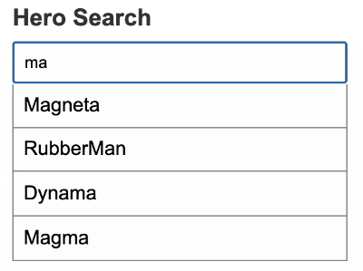

# Obtener datos de un servidor

En este tutorial, agregará las siguientes funciones de persistencia de datos con la ayuda de Angular [`HttpClient`](https://angular.io/api/common/http/HttpClient).

- El `HeroService` obtiene datos del héroe con las peticiones HTTP.
- Los usuarios pueden agregar, editar y eliminar héroes y guardar estos cambios a través de HTTP.
- Los usuarios pueden buscar héroes por su nombre.

> Para ver la aplicación de muestra que se describe en esta página, consulte la [ejemplo en vivo](https://angular.io/generated/live-examples/toh-pt1/stackblitz.html)/[ejemplo de descarga](https://angular.io/generated/zips/toh-pt1/toh-pt1.zip).

---

## Habilitar los servicios HTTP

[`HttpClient`](https://angular.io/api/common/http/HttpClient) es el mecanismo de Angular para comunicarse con un servidor remoto a través de HTTP.

Ponga [`HttpClient`](https://angular.io/api/common/http/HttpClient) a disposición en todas partes de la aplicación en dos pasos. Primero, agréguelo a la raíz `AppModule` importándolo:

```ts
// src/app/app.module.ts (HttpClientModule import)

import { HttpClientModule } from "@angular/common/http";
```

A continuación, todavía en el `AppModule`, agregue [`HttpClientModule`](https://angular.io/api/common/http/HttpClientModule) a la matriz `imports`:

```ts
// src/app/app.module.ts (imports array excerpt)

@NgModule({
  imports: [
    HttpClientModule,
  ],
})
```

---

## Simular un servidor de datos

Este ejemplo de tutorial imita la comunicación con un servidor de datos remoto utilizando el módulo [In-memory Web API](https://github.com/angular/angular/tree/master/packages/misc/angular-in-memory-web-api).

Después de instalar el módulo, la aplicación realizará solicitudes y recibirá respuestas del [`HttpClient`](https://angular.io/api/common/http/HttpClient) sin saber que la _In-memory Web API_ está interceptando esas solicitudes, aplicándolas a un almacén de datos en memoria y devolviendo respuestas simuladas.

Al utilizar la In-memory Web API, no tendrá que configurar un servidor para aprender [`HttpClient`](https://angular.io/api/common/http/HttpClient).

> Importante: el módulo In-memory Web API no tiene nada que ver con HTTP en Angular.
>
> Si está leyendo este tutorial para obtener más información acerca de [`HttpClient`](https://angular.io/api/common/http/HttpClient), puede [omitir este paso](). Si está codificando junto con este tutorial, quédese aquí y agregue el In-memory Web API ahora.

Instale el paquete de API web en memoria de npm con el siguiente comando:

```bash
npm install angular-in-memory-web-api --save
```

En el `AppModule`, importe el `HttpClientInMemoryWebApiModule` y la clase `InMemoryDataService`, que creará en un momento.

```ts
// src/app/app.module.ts (In-memory Web API imports)

import { HttpClientInMemoryWebApiModule } from "angular-in-memory-web-api";
import { InMemoryDataService } from "./in-memory-data.service";
```

Después del [`HttpClientModule`](https://angular.io/api/common/http/HttpClientModule), agregue el `HttpClientInMemoryWebApiModule` a la matriz `imports` de `AppModule` y configúrelo con el `InMemoryDataService`.

```ts
// src/app/app.module.ts (imports array excerpt)

HttpClientModule,
  // The HttpClientInMemoryWebApiModule module intercepts HTTP requests
  // and returns simulated server responses.
  // Remove it when a real server is ready to receive requests.
  HttpClientInMemoryWebApiModule.forRoot(InMemoryDataService, {
    dataEncapsulation: false,
  });
```

El método `forRoot()` de configuración toma una clase `InMemoryDataService` que prepara la base de datos en memoria.

Genere la clase `src/app/in-memory-data.service.ts` con el siguiente comando:

```bash
ng generate service InMemoryData
```

Reemplace el contenido predeterminado de `in-memory-data.service.ts` por lo siguiente:

```ts
// src/app/in-memory-data.service.ts

import { Injectable } from "@angular/core";
import { InMemoryDbService } from "angular-in-memory-web-api";
import { Hero } from "./hero";

@Injectable({
  providedIn: "root",
})
export class InMemoryDataService implements InMemoryDbService {
  createDb() {
    const heroes = [
      { id: 11, name: "Dr Nice" },
      { id: 12, name: "Narco" },
      { id: 13, name: "Bombasto" },
      { id: 14, name: "Celeritas" },
      { id: 15, name: "Magneta" },
      { id: 16, name: "RubberMan" },
      { id: 17, name: "Dynama" },
      { id: 18, name: "Dr IQ" },
      { id: 19, name: "Magma" },
      { id: 20, name: "Tornado" },
    ];
    return { heroes };
  }

  // Overrides the genId method to ensure that a hero always has an id.
  // If the heroes array is empty,
  // the method below returns the initial number (11).
  // if the heroes array is not empty, the method below returns the highest
  // hero id + 1.
  genId(heroes: Hero[]): number {
    return heroes.length > 0
      ? Math.max(...heroes.map((hero) => hero.id)) + 1
      : 11;
  }
}
```

El archivo `in-memory-data.service.ts` asumirá la función de `mock-heroes.ts`. Sin embargo, no elimine `mock-heroes.ts` todavía, ya que aún lo necesitará para algunos pasos más de este tutorial.

Cuando el servidor esté listo, desconectará la API web en memoria y las solicitudes de la aplicación pasarán al servidor.

---

## Héroes y HTTP

En `HeroService`, importar [`HttpClient`](https://angular.io/api/common/http/HttpClient) y [`HttpHeaders`](https://angular.io/api/common/http/HttpHeaders):

```ts
// src/app/hero.service.ts (import HTTP symbols)

import { HttpClient, HttpHeaders } from "@angular/common/http";
```

Aún en el `HeroService`, inyecte [`HttpClient`](https://angular.io/api/common/http/HttpClient) en el constructor en una propiedad privada llamada [`http`](https://angular.io/api/common/http).

```ts
// src/app/hero.service.ts

constructor(
  private http: HttpClient,
  private messageService: MessageService) { }
```

Tenga en cuenta que sigue inyectando el `MessageService`, pero como lo llamará con tanta frecuencia, envuélvalo en un método privado `log()`:

```ts
// src/app/hero.service.ts

/** Log a HeroService message with the MessageService */
private log(message: string) {
  this.messageService.add(`HeroService: ${message}`);
}
```

Defina el `heroesUrl` de la forma `:base/:collectionName` con la dirección del recurso de héroes en el servidor. Este `base` es el recurso al que se realizan las solicitudes y `collectionName` el objeto de datos de héroes en `in-memory-data-service.ts`.

```ts
// src/app/hero.service.ts

private heroesUrl = 'api/heroes';  // URL to web api
```

### Consigue héroes con [`HttpClient`](https://angular.io/api/common/http/HttpClient)

El `HeroService.getHeroes()` actual usa la función RxJS `of()` para devolver una matriz de héroes simulados como un `Observable<Hero[]>`.

```ts
// src/app/hero.service.ts (getHeroes with RxJs 'of()')

getHeroes(): Observable<Hero[]> {
  const heroes = of(HEROES);
  return heroes;
}
```

Convierta ese método para usar [`HttpClient`](https://angular.io/api/common/http/HttpClient) de la siguiente manera:

```ts
// src/app/hero.service.ts

/** GET heroes from the server */
getHeroes(): Observable<Hero[]> {
  return this.http.get<Hero[]>(this.heroesUrl)
}
```

Actualiza el navegador. Los datos del héroe deberían cargarse correctamente desde el servidor simulado.

Usted ha intercambiado `of()` por `http.get()` y la aplicación se mantiene trabajando sin ningún otro cambio debido a que ambas funciones devuelven una `Observable<Hero[]>`.

### Los métodos [`HttpClient`](https://angular.io/api/common/http/HttpClient) devuelven un valor

Todos los métodos [`HttpClient`](https://angular.io/api/common/http/HttpClient) devuelven un `Observable` RxJS de algo.

HTTP es un protocolo de solicitud/respuesta. Realiza una solicitud, devuelve una única respuesta.

En general, un observable _puede_ devolver varios valores a lo largo del tiempo. Un observable de [`HttpClient`](https://angular.io/api/common/http/HttpClient) siempre emite un valor único y luego se completa, para no volver a emitir nunca.

Esta llamada [`HttpClient.get()`](https://angular.io/api/common/http/HttpClient#get) en particular devuelve un `Observable<Hero[]>`; es decir, "un observable de matrices de héroes". En la práctica, solo devolverá una única matriz de héroe.

### [`HttpClient.get()`](https://angular.io/api/common/http/HttpClient#get) devuelve datos de respuesta

[`HttpClient.get()`](https://angular.io/api/common/http/HttpClient#get) devuelve el cuerpo de la respuesta como un objeto JSON sin tipo de forma predeterminada. Aplicando el especificador de tipo opcional `<Hero[]>`, agrega capacidades de TypeScript, que reducen los errores durante el tiempo de compilación.

La API de datos del servidor determina la forma de los datos JSON. La API de datos _Tour of Heroes_ devuelve los datos del héroe como una matriz.

> Otras API pueden enterrar los datos que desea dentro de un objeto. Es posible que `Observable` deba extraer esos datos procesando el resultado con el operador RxJS `map()`.
>
> Aunque no se trata aquí, hay un ejemplo de `map()` en el método `getHeroNo404()` incluido en el código fuente de muestra.

### Manejo de errores

Las cosas salen mal, especialmente cuando obtiene datos de un servidor remoto. El método `HeroService.getHeroes()` debería detectar errores y hacer algo apropiado.

Para detectar errores, **"canaliza" el resultado observable** desde `http.get()` a través de un operador RxJS `catchError()`.

Importe el símbolo `catchError` de `rxjs/operators`, junto con otros operadores que necesitará más adelante.

```ts
// src/app/hero.service.ts

import { catchError, map, tap } from "rxjs/operators";
```

Ahora amplíe el resultado observable con el método `pipe()` y asígnele un operador `catchError()`.

```ts
// src/app/hero.service.ts

getHeroes(): Observable<Hero[]> {
  return this.http.get<Hero[]>(this.heroesUrl)
    .pipe(
      catchError(this.handleError<Hero[]>('getHeroes', []))
    );
}
```

El operador `catchError()` intercepta un **error** `Observable`. Luego, el operador pasa el error a la función de manejo de errores.

El siguiente método `handleError()` informa del error y luego devuelve un resultado inocuo para que la aplicación siga funcionando.

#### **`handleError`**

El siguiente `handleError()` será compartido por muchos métodos `HeroService`, por lo que se generaliza para satisfacer sus diferentes necesidades.

En lugar de manejar el error directamente, devuelve una función de manejo de errores al `catchError` que ha configurado con el nombre de la operación que falló y un valor de retorno seguro.

```ts
// src/app/hero.service.ts

/**
 * Handle Http operation that failed.
 * Let the app continue.
 * @param operation - name of the operation that failed
 * @param result - optional value to return as the observable result
 */
private handleError<T>(operation = 'operation', result?: T) {
  return (error: any): Observable<T> => {

    // TODO: send the error to remote logging infrastructure
    console.error(error); // log to console instead

    // TODO: better job of transforming error for user consumption
    this.log(`${operation} failed: ${error.message}`);

    // Let the app keep running by returning an empty result.
    return of(result as T);
  };
}
```

Después de informar el error a la consola, el controlador crea un mensaje fácil de usar y devuelve un valor seguro a la aplicación para que pueda seguir funcionando.

Debido a que cada método de servicio devuelve un tipo de resultado `Observable` diferente, `handleError()` toma un parámetro de tipo para que pueda devolver el valor seguro como el tipo que espera la aplicación.

### Aprovecha lo observable

Los métodos `HeroService` aprovecharán el flujo de valores observables y enviarán un mensaje, utilizando el método `log()`, al área de mensajes en la parte inferior de la página.

Lo harán con el operador RxJS `tap()`, que mira los valores observables, hace algo con esos valores y los transmite. La devolución de llamada `tap()` no toca los valores en sí.

Aquí está la versión final de `getHeroes()` con `tap()` que registra la operación.

```ts
// src/app/hero.service.ts

/** GET heroes from the server */
getHeroes(): Observable<Hero[]> {
  return this.http.get<Hero[]>(this.heroesUrl)
    .pipe(
      tap(_ => this.log('fetched heroes')),
      catchError(this.handleError<Hero[]>('getHeroes', []))
    );
}
```

### Obtener héroe por id

La mayoría de las API web admiten una solicitud de _obtención por identificación_ en la forma `:baseURL/:id`.

Aquí, la _URL base_ es la `heroesURL` definida en la sección [Héroes y HTTP]() (`api/heroes`) y la identificación es el número del héroe que desea recuperar. Por ejemplo, `api/heroes/11`.

Actualice el método de `HeroService` `getHero()` con lo siguiente para realizar esa solicitud:

```ts
// src/app/hero.service.ts

/** GET hero by id. Will 404 if id not found */
getHero(id: number): Observable<Hero> {
  const url = `${this.heroesUrl}/${id}`;
  return this.http.get<Hero>(url).pipe(
    tap(_ => this.log(`fetched hero id=${id}`)),
    catchError(this.handleError<Hero>(`getHero id=${id}`))
  );
}
```

Hay tres diferencias significativas de `getHeroes()`:

- `getHero()` construye una URL de solicitud con la identificación del héroe deseado.
- El servidor debe responder con un solo héroe en lugar de una serie de héroes.
- `getHero()` devuelve un `Observable<Hero>` (_"un observable de objetos Hero"_) en lugar de un observable de _matrices_ de héroes .

---

## Actualizar héroes

Edite el nombre de un héroe en la vista de detalles del héroe. A medida que escribe, el nombre del héroe actualiza el encabezado en la parte superior de la página. Pero cuando hace clic en el "botón retroceder", los cambios se pierden.

Si desea que los cambios persistan, debe volver a escribirlos en el servidor.

Al final de la plantilla de detalles de héroe, agregue un botón de guardar con un enlace de evento `click` que invoca un nuevo método de componente llamado `save()`.

```html
<!-- src/app/hero-detail/hero-detail.component.html (save) -->

<button (click)="save()">save</button>
```

En la clase de componente `HeroDetail`, agregue el siguiente método `save()`, que persiste los cambios de nombre de héroe utilizando el método de servicio de héroe `updateHero()` y luego navega de regreso a la vista anterior.

```ts
// src/app/hero-detail/hero-detail.component.ts (save)

save(): void {
  if (this.hero) {
    this.heroService.updateHero(this.hero)
      .subscribe(() => this.goBack());
  }
}
```

### Agregar `HeroService.updateHero()`

La estructura general del método `updateHero()` es similar a la de `getHeroes()`, pero se usa `http.put()` para conservar el héroe cambiado en el servidor. Agregue lo siguiente al `HeroService`.

```ts
// src/app/hero.service.ts (update)

/** PUT: update the hero on the server */
updateHero(hero: Hero): Observable<any> {
  return this.http.put(this.heroesUrl, hero, this.httpOptions).pipe(
    tap(_ => this.log(`updated hero id=${hero.id}`)),
    catchError(this.handleError<any>('updateHero'))
  );
}
```

El método [`HttpClient.put()`](https://angular.io/api/common/http/HttpClient#put) toma tres parámetros:

- la URL
- los datos para actualizar (el héroe modificado en este caso)
- opciones

La URL no se modifica. La API web de héroes sabe qué héroe actualizar al observar el `id` del héroe .

La API web de héroes espera un encabezado especial en las solicitudes de guardado HTTP. Ese encabezado está en la constante `httpOptions` definida en `HeroService`. Agregue lo siguiente a la clase `HeroService`.

```ts
// src/app/hero.service.ts

httpOptions = {
  headers: new HttpHeaders({ "Content-Type": "application/json" }),
};
```

Actualiza el navegador, cambia el nombre de un héroe y guarda tu cambio. El método `save()` en `HeroDetailComponent` navega a la vista anterior. El héroe ahora aparece en la lista con el nombre cambiado.

---

## Agrega un nuevo héroe

Para agregar un héroe, esta aplicación solo necesita el nombre del héroe. Puede usar un elemento `<input>` emparejado con un botón **Add**.

Inserte lo siguiente en la plantilla `HeroesComponent`, después del encabezado:

```html
<!-- src/app/heroes/heroes.component.html (add) -->

<div>
  <label for="new-hero">Hero name: </label>
  <input id="new-hero" #heroName />

  <!-- (click) passes input value to add() and then clears the input -->
  <button class="add-button" (click)="add(heroName.value); heroName.value=''">
    Add hero
  </button>
</div>
```

En respuesta a un evento de clic, llame al controlador de clic del componente, `add()`, y luego borre el campo de entrada para que esté listo para otro nombre. Agregue lo siguiente a la clase `HeroesComponent`:

```ts
// src/app/heroes/heroes.component.ts (add)

add(name: string): void {
  name = name.trim();
  if (!name) { return; }
  this.heroService.addHero({ name } as Hero)
    .subscribe(hero => {
      this.heroes.push(hero);
    });
}
```

Cuando el nombre de pila no está en blanco, el controlador crea un objeto `Hero` similar al nombre (solo le falta el `id`) y lo pasa al método de servicio `addHero()`.

Cuando `addHero()` guarda con éxito, la devolución de llamada `subscribe()` recibe al nuevo héroe y lo empuja a la lista `heroes` para mostrarlo.

Agregue el siguiente método `addHero()` a la clase `HeroService`.

```ts
// src/app/hero.service.ts (addHero)

/** POST: add a new hero to the server */
addHero(hero: Hero): Observable<Hero> {
  return this.http.post<Hero>(this.heroesUrl, hero, this.httpOptions).pipe(
    tap((newHero: Hero) => this.log(`added hero w/ id=${newHero.id}`)),
    catchError(this.handleError<Hero>('addHero'))
  );
}
```

`addHero()` se diferencia de `updateHero()` de dos formas:

- Llama a [`HttpClient.post()`](https://angular.io/api/common/http/HttpClient#post) en lugar de `put()`.
- Espera que el servidor genere una identificación para el nuevo héroe, que devuelve en el `Observable<Hero>` a la llamada.

Actualiza el navegador y agrega algunos héroes.

---

## Eliminar un héroe

Cada héroe de la lista de héroes debe tener un botón de eliminación.

Agregue el siguiente elemento de botón a la plantilla `HeroesComponent`, después del nombre del héroe en el elemento repetido `<li>`.

```html
<!-- src/app/heroes/heroes.component.html -->

<button class="delete" title="delete hero" (click)="delete(hero)">x</button>
```

El HTML de la lista de héroes debería verse así:

```html
<!-- src/app/heroes/heroes.component.html (list of heroes) -->

<ul class="heroes">
  <li *ngFor="let hero of heroes">
    <a routerLink="/detail/{{hero.id}}">
      <span class="badge">{{hero.id}}</span> {{hero.name}}
    </a>
    <button class="delete" title="delete hero" (click)="delete(hero)">x</button>
  </li>
</ul>
```

Para colocar el botón de eliminar en el extremo derecho de la entrada del héroe, agregue algo de CSS al archivo `heroes.component.css`. Encontrará ese CSS en la [revisión final de código]() a continuación.

Agregue el controlador `delete()` a la clase de componente.

```ts
// src/app/heroes/heroes.component.ts (delete)

delete(hero: Hero): void {
  this.heroes = this.heroes.filter(h => h !== hero);
  this.heroService.deleteHero(hero.id).subscribe();
}
```

Aunque el componente delega la eliminación de héroes en el `HeroService`, sigue siendo responsable de actualizar su propia lista de héroes. El método `delete()` del componente elimina inmediatamente el _héroe a eliminar_ de esa lista, anticipando que `HeroService` tendrá éxito en el servidor.

Realmente no hay nada que ver el componente con el `Observable` devuelto por `heroService.delete()`, pero debe suscribirse de todos modos.

> Si se niega a usar `subscribe()`, el servicio no enviará la solicitud de eliminación al servidor. Como regla general, un `Observable` _no hace nada_ hasta que algo se suscribe.
>
> Confirma esto por ti mismo eliminando temporalmente el `subscribe()`, haciendo clic en "Dashboard" y luego en "Héroes". Verás la lista completa de héroes nuevamente.

A continuación, agregue un método `deleteHero()` a `HeroService` de esta manera.

```ts
// src/app/hero.service.ts (delete)

/** DELETE: delete the hero from the server */
deleteHero(id: number): Observable<Hero> {
  const url = `${this.heroesUrl}/${id}`;

  return this.http.delete<Hero>(url, this.httpOptions).pipe(
    tap(_ => this.log(`deleted hero id=${id}`)),
    catchError(this.handleError<Hero>('deleteHero'))
  );
}
```

Tenga en cuenta los siguientes puntos clave:

- `deleteHero()` llama a [`HttpClient.delete()`](https://angular.io/api/common/http/HttpClient#delete).
- La URL es la URL del recurso de héroes más el `id` del héroe que se va a eliminar.
- No envía datos como lo hizo con `put()` y `post()`.
- Aún envías el `httpOptions`.

Actualice el navegador y pruebe la nueva función de eliminación.

---

## Buscar por nombre

En este último ejercicio, aprenderá a encadenar operadores `Observable` para que pueda minimizar la cantidad de solicitudes HTTP similares y consumir ancho de banda de la red de manera económica.

Agregará una función de búsqueda de héroes al Dashboard. A medida que el usuario escribe un nombre en un cuadro de búsqueda, realizarás solicitudes HTTP repetidas para héroes filtrados por ese nombre. Su objetivo es emitir solo tantas solicitudes como sea necesario.

#### **`HeroService.searchHeroes()`**

Comience agregando un método `searchHeroes()` al `HeroService`.

```ts
// src/app/hero.service.ts

/* GET heroes whose name contains search term */
searchHeroes(term: string): Observable<Hero[]> {
  if (!term.trim()) {
    // if not search term, return empty hero array.
    return of([]);
  }
  return this.http.get<Hero[]>(`${this.heroesUrl}/?name=${term}`).pipe(
    tap(x => x.length ?
       this.log(`found heroes matching "${term}"`) :
       this.log(`no heroes matching "${term}"`)),
    catchError(this.handleError<Hero[]>('searchHeroes', []))
  );
}
```

El método regresa inmediatamente con una matriz vacía si no hay un término de búsqueda. El resto se parece mucho `getHeroes()`, la única diferencia significativa es la URL, que incluye una string de consulta con el término de búsqueda.

### Agregar búsqueda al Dashboard

Abra la plantilla `DashboardComponent` y agregue el elemento de búsqueda de héroe `<app-hero-search>`, al final del marcado.

```html
<!-- src/app/dashboard/dashboard.component.html -->

<h2>Top Heroes</h2>
<div class="heroes-menu">
  <a *ngFor="let hero of heroes" routerLink="/detail/{{hero.id}}">
    {{hero.name}}
  </a>
</div>

<app-hero-search></app-hero-search>
```

Esta plantilla se parece mucho al repetidor [`*ngFor`](https://angular.io/api/common/NgForOf) de la plantilla `HeroesComponent`.

Para que esto funcione, el siguiente paso es agregar un componente con un selector que coincida `<app-hero-search>`.

### Crear `HeroSearchComponent`

Cree un `HeroSearchComponent` con la CLI.

```bash
ng generate component hero-search
```

La CLI genera los tres archivos `HeroSearchComponent` y agrega el componente a las declaraciones de `AppModule`.

Reemplace la plantilla `HeroSearchComponent` generada con una `<input>` y una lista de resultados de búsqueda coincidentes, como sigue.

```html
<!-- src/app/hero-search/hero-search.component.html -->

<div id="search-component">
  <label for="search-box">Hero Search</label>
  <input #searchBox id="search-box" (input)="search(searchBox.value)" />

  <ul class="search-result">
    <li *ngFor="let hero of heroes$ | async">
      <a routerLink="/detail/{{hero.id}}"> {{hero.name}} </a>
    </li>
  </ul>
</div>
```

Agregue estilos CSS privados a `hero-search.component.css` que se enumeran en la [revisión final del código]() a continuación.

A medida que el usuario escribe en el cuadro de búsqueda, un enlace de evento de entrada llama al método `search()` del componente con el nuevo valor del cuadro de búsqueda.

#### [`AsyncPipe`](https://angular.io/api/common/AsyncPipe)

El [`*ngFor`](https://angular.io/api/common/NgForOf) repite los objetos hero. Observe que [`*ngFor`](https://angular.io/api/common/NgForOf) itera sobre una lista llamada `heroes$`, no `heroes`. El `$` es una convención que indica que `heroes$` es un `Observable`, no una matriz.

```html
<!-- src/app/hero-search/hero-search.component.html-->

<li *ngFor="let hero of heroes$ | async"></li>
```

Como [`*ngFor`](https://angular.io/api/common/NgForOf) no puede hacer nada con un `Observable`, use el carácter de barra vertical (`|`) seguido de [`async`](https://angular.io/api/common/AsyncPipe). Esto identifica un [`AsyncPipe`](https://angular.io/api/common/AsyncPipe) de Angular y se suscribe automáticamente a un `Observable` para que no tenga que hacerlo en la clase de componente.

### Edita la clase `HeroSearchComponent`

Reemplace la clase `HeroSearchComponent` y los metadatos generados de la siguiente manera.

```ts
// src/app/hero-search/hero-search.component.ts

import { Component, OnInit } from "@angular/core";

import { Observable, Subject } from "rxjs";

import { debounceTime, distinctUntilChanged, switchMap } from "rxjs/operators";

import { Hero } from "../hero";
import { HeroService } from "../hero.service";

@Component({
  selector: "app-hero-search",
  templateUrl: "./hero-search.component.html",
  styleUrls: ["./hero-search.component.css"],
})
export class HeroSearchComponent implements OnInit {
  heroes$!: Observable<Hero[]>;
  private searchTerms = new Subject<string>();

  constructor(private heroService: HeroService) {}

  // Push a search term into the observable stream.
  search(term: string): void {
    this.searchTerms.next(term);
  }

  ngOnInit(): void {
    this.heroes$ = this.searchTerms.pipe(
      // wait 300ms after each keystroke before considering the term
      debounceTime(300),

      // ignore new term if same as previous term
      distinctUntilChanged(),

      // switch to new search observable each time the term changes
      switchMap((term: string) => this.heroService.searchHeroes(term))
    );
  }
}
```

Observe la declaración de `heroes$` como `Observable`:

```ts
// src/app/hero-search/hero-search.component.ts

heroes$!: Observable<Hero[]>;
```

Configurará `ngOnInit()`. Antes de hacerlo, concéntrese en la definición de `searchTerms`.

### El sujeto de RxJS `searchTerms`

La propiedad `searchTerms` es un `Subject` RxJS.

```ts
// src/app/hero-search/hero-search.component.ts

private searchTerms = new Subject<string>();

// Push a search term into the observable stream.
search(term: string): void {
  this.searchTerms.next(term);
}
```

Un `Subject` es tanto una fuente de valores observables como un `Observable` en sí mismo. Puede suscribirse a un `Subject` como lo haría con cualquier otro `Observable`.

También puede insertar valores en ese `Observable` llamando a su método `next(value)` como lo hace el método `search()`.

El evento que se vincula al evento del cuadro de texto `input` llama al método `search()`.

```html
<!-- src/app/hero-search/hero-search.component.html -->

<input #searchBox id="search-box" (input)="search(searchBox.value)" />
```

Cada vez que el usuario escribe en el cuadro de texto, el enlace llama a `search()` con el valor del cuadro de texto, un "término de búsqueda". `searchTerms` se convierte en un `Observable` emisor de un flujo constante de términos de búsqueda.

### Encadenamiento de operadores RxJS

Pasar un nuevo término de búsqueda directamente a `searchHeroes()` después de cada pulsación de tecla del usuario crearía una cantidad excesiva de solicitudes HTTP, gravando los recursos del servidor y quemando planes de datos.

En cambio, el método `ngOnInit()` canaliza los `searchTerms` observables a través de una secuencia de operadores RxJS que reducen el número de llamadas al `searchHeroes()`, finalmente devolviendo un observable de resultados de búsqueda de héroes oportunos (cada `Hero[]`).

Aquí hay un vistazo más de cerca al código.

```ts
// src/app/hero-search/hero-search.component.ts

this.heroes$ = this.searchTerms.pipe(
  // wait 300ms after each keystroke before considering the term
  debounceTime(300),

  // ignore new term if same as previous term
  distinctUntilChanged(),

  // switch to new search observable each time the term changes
  switchMap((term: string) => this.heroService.searchHeroes(term))
);
```

Cada operador trabaja de la siguiente manera:

- `debounceTime(300)` espera hasta que el flujo de nuevos eventos de string se detiene durante 300 milisegundos antes de pasar el último string. Nunca realizarás solicitudes con una frecuencia superior a 300ms.

- `distinctUntilChanged()` asegura que se envíe una solicitud solo si el texto del filtro cambió.

- `switchMap()` llama al servicio de búsqueda para cada término de búsqueda que pasa por `debounce()` y `distinctUntilChanged()`. Cancela y descarta los observables de búsqueda anteriores, devolviendo solo el último servicio de búsqueda observable.

> Con el [operador switchMap](https://www.learnrxjs.io/learn-rxjs/operators/transformation/switchmap), cada evento de tecla calificado puede desencadenar una llamada a un método [`HttpClient.get()`](https://angular.io/api/common/http/HttpClient#get). Incluso con una pausa de 300ms entre solicitudes, podría tener varias solicitudes HTTP en curso y es posible que no regresen en el pedido enviado.
>
> `switchMap()` conserva el orden de solicitud original mientras devuelve solo lo observable de la llamada al método HTTP más reciente. Los resultados de llamadas anteriores se cancelan y descartan.
>
> Tenga en cuenta que cancelar un Observable `searchHeroes()` anterior en realidad no aborta una solicitud HTTP pendiente. Los resultados no deseados se descartan antes de que lleguen al código de su aplicación.

Recuerde que la clase de componente no se suscribe al _observable_ `heroes$`. Ese es el trabajo de la plantilla `AsyncPipe`.

#### **Intentalo**

Ejecute la aplicación nuevamente. En el Dashboard, ingrese algún texto en el cuadro de búsqueda. Si ingresa caracteres que coinciden con cualquier nombre de héroe existente, verá algo como esto.



---

## Revisión final del código

Aquí están los archivos de código discutidos en esta página (todos en la carpeta `src/app/`).

### `HeroService`, `InMemoryDataService`, `AppModule`

```ts
// hero.service.ts

import { Injectable } from "@angular/core";
import { HttpClient, HttpHeaders } from "@angular/common/http";

import { Observable, of } from "rxjs";
import { catchError, map, tap } from "rxjs/operators";

import { Hero } from "./hero";
import { MessageService } from "./message.service";

@Injectable({ providedIn: "root" })
export class HeroService {
  private heroesUrl = "api/heroes"; // URL to web api

  httpOptions = {
    headers: new HttpHeaders({ "Content-Type": "application/json" }),
  };

  constructor(
    private http: HttpClient,
    private messageService: MessageService
  ) {}

  /** GET heroes from the server */
  getHeroes(): Observable<Hero[]> {
    return this.http.get<Hero[]>(this.heroesUrl).pipe(
      tap((_) => this.log("fetched heroes")),
      catchError(this.handleError<Hero[]>("getHeroes", []))
    );
  }

  /** GET hero by id. Return `undefined` when id not found */
  getHeroNo404<Data>(id: number): Observable<Hero> {
    const url = `${this.heroesUrl}/?id=${id}`;
    return this.http.get<Hero[]>(url).pipe(
      map((heroes) => heroes[0]), // returns a {0|1} element array
      tap((h) => {
        const outcome = h ? `fetched` : `did not find`;
        this.log(`${outcome} hero id=${id}`);
      }),
      catchError(this.handleError<Hero>(`getHero id=${id}`))
    );
  }

  /** GET hero by id. Will 404 if id not found */
  getHero(id: number): Observable<Hero> {
    const url = `${this.heroesUrl}/${id}`;
    return this.http.get<Hero>(url).pipe(
      tap((_) => this.log(`fetched hero id=${id}`)),
      catchError(this.handleError<Hero>(`getHero id=${id}`))
    );
  }

  /* GET heroes whose name contains search term */
  searchHeroes(term: string): Observable<Hero[]> {
    if (!term.trim()) {
      // if not search term, return empty hero array.
      return of([]);
    }
    return this.http.get<Hero[]>(`${this.heroesUrl}/?name=${term}`).pipe(
      tap((x) =>
        x.length
          ? this.log(`found heroes matching "${term}"`)
          : this.log(`no heroes matching "${term}"`)
      ),
      catchError(this.handleError<Hero[]>("searchHeroes", []))
    );
  }

  //////// Save methods //////////

  /** POST: add a new hero to the server */
  addHero(hero: Hero): Observable<Hero> {
    return this.http.post<Hero>(this.heroesUrl, hero, this.httpOptions).pipe(
      tap((newHero: Hero) => this.log(`added hero w/ id=${newHero.id}`)),
      catchError(this.handleError<Hero>("addHero"))
    );
  }

  /** DELETE: delete the hero from the server */
  deleteHero(id: number): Observable<Hero> {
    const url = `${this.heroesUrl}/${id}`;

    return this.http.delete<Hero>(url, this.httpOptions).pipe(
      tap((_) => this.log(`deleted hero id=${id}`)),
      catchError(this.handleError<Hero>("deleteHero"))
    );
  }

  /** PUT: update the hero on the server */
  updateHero(hero: Hero): Observable<any> {
    return this.http.put(this.heroesUrl, hero, this.httpOptions).pipe(
      tap((_) => this.log(`updated hero id=${hero.id}`)),
      catchError(this.handleError<any>("updateHero"))
    );
  }

  /**
   * Handle Http operation that failed.
   * Let the app continue.
   * @param operation - name of the operation that failed
   * @param result - optional value to return as the observable result
   */
  private handleError<T>(operation = "operation", result?: T) {
    return (error: any): Observable<T> => {
      // TODO: send the error to remote logging infrastructure
      console.error(error); // log to console instead

      // TODO: better job of transforming error for user consumption
      this.log(`${operation} failed: ${error.message}`);

      // Let the app keep running by returning an empty result.
      return of(result as T);
    };
  }

  /** Log a HeroService message with the MessageService */
  private log(message: string) {
    this.messageService.add(`HeroService: ${message}`);
  }
}
```

```ts
// in-memory-data.service.ts

import { Injectable } from "@angular/core";
import { InMemoryDbService } from "angular-in-memory-web-api";
import { Hero } from "./hero";

@Injectable({
  providedIn: "root",
})
export class InMemoryDataService implements InMemoryDbService {
  createDb() {
    const heroes = [
      { id: 11, name: "Dr Nice" },
      { id: 12, name: "Narco" },
      { id: 13, name: "Bombasto" },
      { id: 14, name: "Celeritas" },
      { id: 15, name: "Magneta" },
      { id: 16, name: "RubberMan" },
      { id: 17, name: "Dynama" },
      { id: 18, name: "Dr IQ" },
      { id: 19, name: "Magma" },
      { id: 20, name: "Tornado" },
    ];
    return { heroes };
  }

  // Overrides the genId method to ensure that a hero always has an id.
  // If the heroes array is empty,
  // the method below returns the initial number (11).
  // if the heroes array is not empty, the method below returns the highest
  // hero id + 1.
  genId(heroes: Hero[]): number {
    return heroes.length > 0
      ? Math.max(...heroes.map((hero) => hero.id)) + 1
      : 11;
  }
}
```

```ts
// app.module.ts

import { NgModule } from "@angular/core";
import { BrowserModule } from "@angular/platform-browser";
import { FormsModule } from "@angular/forms";
import { HttpClientModule } from "@angular/common/http";

import { HttpClientInMemoryWebApiModule } from "angular-in-memory-web-api";
import { InMemoryDataService } from "./in-memory-data.service";

import { AppRoutingModule } from "./app-routing.module";

import { AppComponent } from "./app.component";
import { DashboardComponent } from "./dashboard/dashboard.component";
import { HeroDetailComponent } from "./hero-detail/hero-detail.component";
import { HeroesComponent } from "./heroes/heroes.component";
import { HeroSearchComponent } from "./hero-search/hero-search.component";
import { MessagesComponent } from "./messages/messages.component";

@NgModule({
  imports: [
    BrowserModule,
    FormsModule,
    AppRoutingModule,
    HttpClientModule,

    // The HttpClientInMemoryWebApiModule module intercepts HTTP requests
    // and returns simulated server responses.
    // Remove it when a real server is ready to receive requests.
    HttpClientInMemoryWebApiModule.forRoot(InMemoryDataService, {
      dataEncapsulation: false,
    }),
  ],
  declarations: [
    AppComponent,
    DashboardComponent,
    HeroesComponent,
    HeroDetailComponent,
    MessagesComponent,
    HeroSearchComponent,
  ],
  bootstrap: [AppComponent],
})
export class AppModule {}
```

### `HeroesComponent`

```html
<!-- heroes/heroes.component.html -->

<h2>My Heroes</h2>

<div>
  <label for="new-hero">Hero name: </label>
  <input id="new-hero" #heroName />

  <!-- (click) passes input value to add() and then clears the input -->
  <button class="add-button" (click)="add(heroName.value); heroName.value=''">
    Add hero
  </button>
</div>

<ul class="heroes">
  <li *ngFor="let hero of heroes">
    <a routerLink="/detail/{{hero.id}}">
      <span class="badge">{{hero.id}}</span> {{hero.name}}
    </a>
    <button class="delete" title="delete hero" (click)="delete(hero)">x</button>
  </li>
</ul>
```

```ts
// heroes/heroes.component.ts

import { Component, OnInit } from "@angular/core";

import { Hero } from "../hero";
import { HeroService } from "../hero.service";

@Component({
  selector: "app-heroes",
  templateUrl: "./heroes.component.html",
  styleUrls: ["./heroes.component.css"],
})
export class HeroesComponent implements OnInit {
  heroes: Hero[] = [];

  constructor(private heroService: HeroService) {}

  ngOnInit() {
    this.getHeroes();
  }

  getHeroes(): void {
    this.heroService.getHeroes().subscribe((heroes) => (this.heroes = heroes));
  }

  add(name: string): void {
    name = name.trim();
    if (!name) {
      return;
    }
    this.heroService.addHero({ name } as Hero).subscribe((hero) => {
      this.heroes.push(hero);
    });
  }

  delete(hero: Hero): void {
    this.heroes = this.heroes.filter((h) => h !== hero);
    this.heroService.deleteHero(hero.id).subscribe();
  }
}
```

```css
/* heroes/heroes.component.css */

/* HeroesComponent's private CSS styles */
.heroes {
  margin: 0 0 2em 0;
  list-style-type: none;
  padding: 0;
  width: 15em;
}

input {
  display: block;
  width: 100%;
  padding: 0.5rem;
  margin: 1rem 0;
  box-sizing: border-box;
}

.heroes li {
  position: relative;
  cursor: pointer;
}

.heroes li:hover {
  left: 0.1em;
}

.heroes a {
  color: #333;
  text-decoration: none;
  background-color: #eee;
  margin: 0.5em;
  padding: 0.3em 0;
  height: 1.6em;
  border-radius: 4px;
  display: block;
  width: 100%;
}

.heroes a:hover {
  color: #2c3a41;
  background-color: #e6e6e6;
}

.heroes a:active {
  background-color: #525252;
  color: #fafafa;
}

.heroes .badge {
  display: inline-block;
  font-size: small;
  color: white;
  padding: 0.8em 0.7em 0 0.7em;
  background-color: #405061;
  line-height: 1em;
  position: relative;
  left: -1px;
  top: -4px;
  height: 1.8em;
  min-width: 16px;
  text-align: right;
  margin-right: 0.8em;
  border-radius: 4px 0 0 4px;
}

.add-button {
  padding: 0.5rem 1.5rem;
  font-size: 1rem;
  margin-bottom: 2rem;
}

.add-button:hover {
  color: white;
  background-color: #42545c;
}

button.delete {
  position: absolute;
  left: 210px;
  top: 5px;
  background-color: white;
  color: #525252;
  font-size: 1.1rem;
  padding: 1px 10px 3px 10px;
}

button.delete:hover {
  background-color: #525252;
  color: white;
}
```

### `HeroDetailComponent`

```html
<!-- hero-detail/hero-detail.component.html -->

<div *ngIf="hero">
  <h2>{{hero.name | uppercase}} Details</h2>
  <div><span>id: </span>{{hero.id}}</div>
  <div>
    <label for="hero-name">Hero name: </label>
    <input id="hero-name" [(ngModel)]="hero.name" placeholder="Hero name" />
  </div>
  <button (click)="goBack()">go back</button>
  <button (click)="save()">save</button>
</div>
```

```ts
// hero-detail/hero-detail.component.ts

import { Component, OnInit } from "@angular/core";
import { ActivatedRoute } from "@angular/router";
import { Location } from "@angular/common";

import { Hero } from "../hero";
import { HeroService } from "../hero.service";

@Component({
  selector: "app-hero-detail",
  templateUrl: "./hero-detail.component.html",
  styleUrls: ["./hero-detail.component.css"],
})
export class HeroDetailComponent implements OnInit {
  hero: Hero | undefined;

  constructor(
    private route: ActivatedRoute,
    private heroService: HeroService,
    private location: Location
  ) {}

  ngOnInit(): void {
    this.getHero();
  }

  getHero(): void {
    const id = parseInt(this.route.snapshot.paramMap.get("id")!, 10);
    this.heroService.getHero(id).subscribe((hero) => (this.hero = hero));
  }

  goBack(): void {
    this.location.back();
  }

  save(): void {
    if (this.hero) {
      this.heroService.updateHero(this.hero).subscribe(() => this.goBack());
    }
  }
}
```

### `DashboardComponent`

```html
<!-- src/app/dashboard/dashboard.component.html -->

<h2>Top Heroes</h2>
<div class="heroes-menu">
  <a *ngFor="let hero of heroes" routerLink="/detail/{{hero.id}}">
    {{hero.name}}
  </a>
</div>

<app-hero-search></app-hero-search>
```

### `HeroSearchComponent`

```html
<!-- hero-search/hero-search.component.html -->

<div id="search-component">
  <label for="search-box">Hero Search</label>
  <input #searchBox id="search-box" (input)="search(searchBox.value)" />

  <ul class="search-result">
    <li *ngFor="let hero of heroes$ | async">
      <a routerLink="/detail/{{hero.id}}"> {{hero.name}} </a>
    </li>
  </ul>
</div>
```

```ts
// hero-search/hero-search.component.ts

import { Component, OnInit } from "@angular/core";

import { Observable, Subject } from "rxjs";

import { debounceTime, distinctUntilChanged, switchMap } from "rxjs/operators";

import { Hero } from "../hero";
import { HeroService } from "../hero.service";

@Component({
  selector: "app-hero-search",
  templateUrl: "./hero-search.component.html",
  styleUrls: ["./hero-search.component.css"],
})
export class HeroSearchComponent implements OnInit {
  heroes$!: Observable<Hero[]>;
  private searchTerms = new Subject<string>();

  constructor(private heroService: HeroService) {}

  // Push a search term into the observable stream.
  search(term: string): void {
    this.searchTerms.next(term);
  }

  ngOnInit(): void {
    this.heroes$ = this.searchTerms.pipe(
      // wait 300ms after each keystroke before considering the term
      debounceTime(300),

      // ignore new term if same as previous term
      distinctUntilChanged(),

      // switch to new search observable each time the term changes
      switchMap((term: string) => this.heroService.searchHeroes(term))
    );
  }
}
```

```css
/* hero-search/hero-search.component.css */

/* HeroSearch private styles */

label {
  display: block;
  font-weight: bold;
  font-size: 1.2rem;
  margin-top: 1rem;
  margin-bottom: 0.5rem;
}
input {
  padding: 0.5rem;
  width: 100%;
  max-width: 600px;
  box-sizing: border-box;
  display: block;
}

input:focus {
  outline: #336699 auto 1px;
}

li {
  list-style-type: none;
}
.search-result li a {
  border-bottom: 1px solid gray;
  border-left: 1px solid gray;
  border-right: 1px solid gray;
  display: inline-block;
  width: 100%;
  max-width: 600px;
  padding: 0.5rem;
  box-sizing: border-box;
  text-decoration: none;
  color: black;
}

.search-result li a:hover {
  background-color: #435a60;
  color: white;
}

ul.search-result {
  margin-top: 0;
  padding-left: 0;
}
```

---

## Resumen

Estás al final de tu viaje y has logrado mucho.

- Agregó las dependencias necesarias para usar HTTP en la aplicación.
- Refactorizó `HeroService` para cargar héroes desde una API web.
- Amplió `HeroService` para soportar métodos `post()`, `put()` y `delete()`.
- Actualizó los componentes para permitir agregar, editar y eliminar héroes.
- Configuraste una API web en memoria.
- Aprendiste a usar observables.

Con esto concluye el tutorial "Tour of Heroes". Está listo para aprender más sobre el desarrollo de Angular en la sección de fundamentos, comenzando con la guía de [Arquitectura](https://angular.io/guide/architecture).
